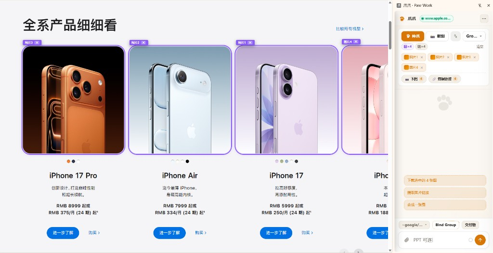
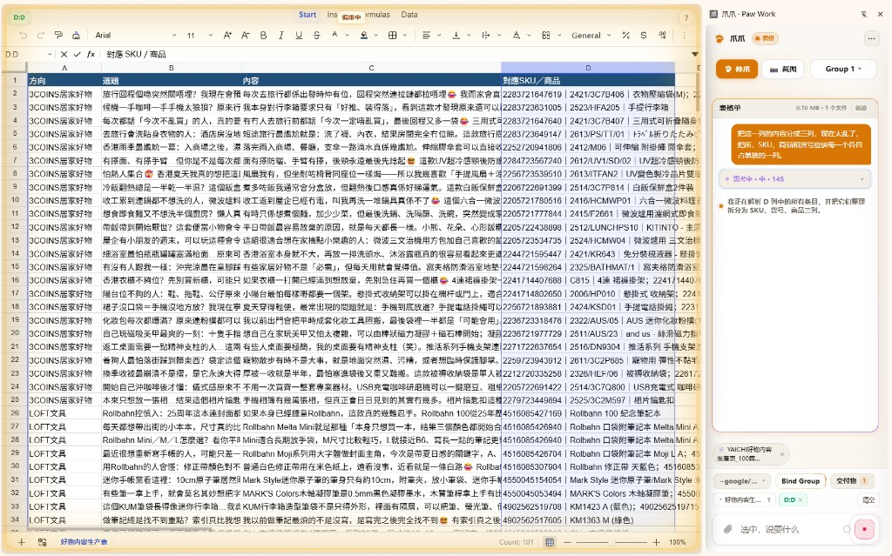
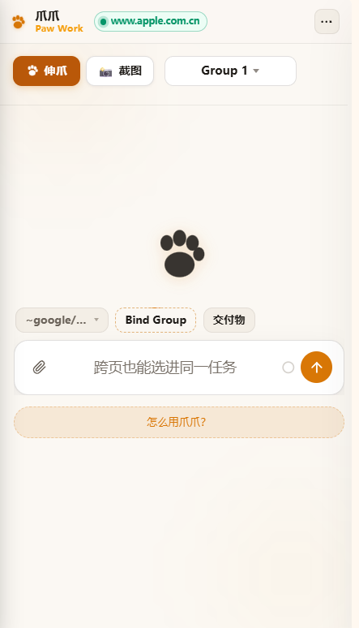

# 爪爪 · Paw Work

**Selection-first web agent for Chrome.** Select on the live page, describe the outcome, take away a real file.

[](https://github.com/Player-YN/PawWork_ZhuaZhua/actions/workflows/ci.yml)
[](LICENSE)


```text
SELECT + DESCRIBE OUTCOME → DELIVER
```

[Install](#install-build-from-source) · [See it](#see-it) · [Highlights](#highlights) · [Architecture](#architecture) · [Limitations](#limitations) · [中文](#中文)

---

## What it is

Paw Work is a Chrome MV3 extension. Turn Paw Mode on, point at things on the page you already have open — images, tables, text, containers, URLs — then describe the deliverable in the sidepanel. The agent works inside a durable session workspace and returns editable office files, not chat prose.

It is not an autonomous web-roaming black box, and not a terminal coding agent. It sits beside the browser world you are already logged into: you set the scope, it returns checkable results.

## See it

Selecting product cards on a live Apple page. The sidepanel holds the capture; the next line in the composer is the outcome.



A live Univer spreadsheet beside the sidepanel. The agent is editing the open workbook in place — here, splitting a SKU column — not dumping a new file into chat.



<p align="center">
  
</p>

Empty session chrome: Paw Mode, capture group, Bind Group, deliverables, composer.

## Highlights

- **Office deliverables on live canvases.** Spreadsheets and long documents open in [Univer](https://univer.ai); posters and slide decks open on a [tldraw](https://tldraw.dev) canvas; websites open as real HTML pages. Click a node, say the change, only that node changes.
- **Semantic slides with a QA gate.** Decks and posters compile from `theme + layout + slots`; the host owns geometry and runs quality checks. A failed check must be repaired on the same artifact — no silent second file.
- **PPTX export, triple-validated.** Slide exports have been verified against the OpenXML validator, LibreOffice, and PowerPoint COM.
- **Site clone and motion.** Rebuild a live page as an editable site artifact, add declarative scroll/entrance motion, gate it with Site QA.
- **Sandboxed code execution.** Model-generated JS/TS compiles with packaged esbuild-wasm and runs in a QuickJS-WASM VM. Generated code never sees `chrome.*`, the live DOM, or another session's files. No executable code is loaded from a CDN.
- **BYOK, local-only keys.** Bring your own OpenAI-compatible endpoints for chat and image generation, plus optional web-acquire keys. Keys stay in Chrome extension storage on your machine.
- **Durable session workspace.** Artifacts persist in IndexedDB + OPFS across restarts; deliverable bytes must match their claimed format.

## Install (build from source)

Prerequisites: Node.js 20+, npm, Chrome 120+.

```bash
git clone https://github.com/Player-YN/PawWork_ZhuaZhua.git
cd PawWork_ZhuaZhua
npm install
npm run build:agent
npm run pack:extension
```

Then open `chrome://extensions`, enable Developer mode, and **Load unpacked** → select `artifacts/unpacked/`. The packed extension is ~44 MB (esbuild.wasm plus locally built Univer and tldraw bundles). Do not load the repository root — it contains `node_modules`.

Rebuild (`npm run build:agent`) and reload the extension after pulling changes.

## Architecture

```text
Sidepanel
  → workspaceRpc (background service worker)
  → Offscreen SessionWorkspaceService
  → every user message: sendMessage
  → AI SDK ToolLoopAgent (toolChoice=auto)
  → tools: inspect / acquire / run / clarify / sheet / deck / doc / web
  → /artifacts (durable) + /scratch (per-execution)
  → live canvases: Univer sheet & docs · tldraw Design/Slides · HTML site
```

The split of duties: the **runtime binds** (session isolation, write policy, open routing, tool inventory, fail-closed office writes) while the **prompt and skills judge** (answer vs deliverable, which playbook, when to clarify, how to compose). See [`docs/PROMPT_RUNTIME.md`](docs/PROMPT_RUNTIME.md) and [`docs/SESSION_WORKSPACE_RUNTIME.md`](docs/SESSION_WORKSPACE_RUNTIME.md).

## BYOK setup

Nothing works without your own keys. All of them live in Chrome extension local storage (legacy `pagewand_*` keys) and are sent only to the endpoints you configure, over HTTPS.

| What | Where | Notes |
|------|-------|-------|
| Chat model | Sidepanel settings → providers (`pagewand_providers`) | Any OpenAI-compatible HTTPS endpoint: base URL + API key + model id |
| Image generation | Optional per-provider `image` config | Separate endpoint/key/model for image output; output modality is detected automatically |
| Web acquire | Sidepanel settings (`pagewand_web_acquire`) | Search: Tavily (default) or Brave; Firecrawl enables fetch scrape, `map`, and `crawl`. Without keys, `fetch` falls back to anonymous GET |
| tldraw license | Optional (`pagewand_tldraw_license` or build-time `PAW_TLDRAW_LICENSE_KEY`) | Removes the tldraw watermark; see Limitations |

## Development

```text
npm run build:agent          # icons + QuickJS + AI SDK + esbuild.wasm + sheet + docs + design
npm run build:icons          # lucide-static → tracked icon pack (2,035 icons)
npm run build:sheet          # Univer + SheetJS → src/preview/vendor/ (gitignored)
npm run build:design         # tldraw → src/preview/vendor/design-runtime.* (gitignored)
npm run pack:extension       # artifacts/unpacked — no node_modules
npm run ci:local             # npm ci + build + full test matrix + pack
```

## Tests

| Command | Scope | Needs |
|---------|-------|-------|
| `npm run test:session-workspace` | S-A…S-R acceptance gate | Node only |
| `npm run test:session-workspace:all` | Gate + office / canvas / site / export suites | Node only |
| `npm run test:session-workspace:attacks` | 15 adversarial waves (isolation, artifact truth, SoT…) | Node only |
| `npm run test:workspace` | MV3 QuickJS load + production import gates | Node only |
| `npm run playwright:install` | One-time Chromium download | network |
| `npm run test:visual-deck` | Real tldraw pixel harness | Playwright Chromium |
| `npm run test:extension-e2e` | Packed MV3 + local mock model | pack + Playwright Chromium |

CI runs the Node-only matrix plus build and pack on every push ([`.github/workflows/ci.yml`](.github/workflows/ci.yml)). The pixel and E2E tests (`test:visual-deck`, `test:extension-e2e`) are not in CI — they assume a local toolchain with Playwright Chromium, as does the optional .NET OpenXML PPTX validator harness. Run those locally before proposing canvas or export changes.

## Limitations

- **tldraw watermark.** tldraw is source-available under its own license. Without a production license key from tldraw, the Design/Slides canvas shows the official watermark and `tldrawLicenseStatus().productionReady` is `false`. Supply your own key via BYOK settings or build env. Hiding the watermark by CSS/DOM is not supported and not acceptable.
- **Extension only.** There is no hosted service, no server, no account. Chrome/Chromium MV3 only.
- **BYOK required.** No bundled model access; chat, image, and web-acquire features each need your own keys.
- **Capture is not full truth.** Selection captures what you point at; the agent inspects on demand and may ask once when the outcome type is genuinely unclear.

## License

MIT for the code in this repository — see [LICENSE](LICENSE). Third-party engines and their licenses are listed in [THIRD_PARTY_NOTICES.md](THIRD_PARTY_NOTICES.md); the large editor bundles (Univer, tldraw) are built locally from npm and are not redistributed here.

---

# 中文

**面向 Chrome 的「选中优先」网页智能体。** 在真实网页上选中你要的东西，说清想要的结果，拿走一份真正可编辑的文件。

```text
选中 + 说出结果 → 交付
```

## 它是什么

爪爪 · Paw Work 是一个 Chrome MV3 扩展。打开爪爪模式，在已经登录、已经打开的网页上点选图片、表格、文字、容器、链接，然后在侧栏里描述你要的交付物。智能体在持久的会话工作区里干活，交回的是可编辑的办公文件，不是聊天段落。

它不是「替你全自动漫游全网」的黑盒，也不是程序员的终端 Agent。它坐在你已经打开的浏览器世界旁边：你指范围，它交付可核对的结果。

## 演示

在已经打开的苹果官网点选商品图。捕获落在侧栏，下一句输入就是要的结果。


活表格开在旁边。智能体在改当前这一本工作簿（这里是拆 SKU 列），不是在聊天里另交一份文件。


<p align="center">
  
</p>

空会话时的侧栏：伸爪、选择组、Bind Group、交付物、输入框。

## 亮点

- **办公交付物落在活画布上。** 表格和长文在 [Univer](https://univer.ai) 里打开；海报和幻灯在 [tldraw](https://tldraw.dev) 画布上打开；网站就是真 HTML 页面。点中节点、说出修改，只有那个节点会变。
- **语义幻灯 + 质检门。** 幻灯/海报按 `主题 + 版式 + 槽位` 语义编译，几何坐标由宿主负责并做质量检查；质检不过必须在同一份文件上修复，不允许悄悄另起一份。
- **PPTX 导出三重验证。** 导出结果经 OpenXML 校验器、LibreOffice、PowerPoint COM 三方验证。
- **网站克隆与动效。** 把活网页重建为可编辑的站点文件，加声明式滚动/入场动效，并有 Site QA 把关。
- **沙箱代码执行。** 模型生成的 JS/TS 用打包的 esbuild-wasm 编译、在 QuickJS-WASM 虚拟机里运行；生成代码看不到 `chrome.*`、活页面 DOM、别的会话的文件，也不会从 CDN 加载任何可执行代码。
- **BYOK，密钥只留在本地。** 自带 OpenAI 兼容的对话与生图端点，可选配置网络检索密钥；全部密钥保存在本机的 Chrome 扩展存储里。
- **持久会话工作区。** 产物存于 IndexedDB + OPFS，重启不丢；文件字节必须与声称的格式相符。

## 安装（从源码构建）

前置：Node.js 20+、npm、Chrome 120+。

```bash
git clone https://github.com/Player-YN/PawWork_ZhuaZhua.git
cd PawWork_ZhuaZhua
npm install
npm run build:agent
npm run pack:extension
```

打开 `chrome://extensions`，启用开发者模式，「加载已解压的扩展程序」→ 选择 `artifacts/unpacked/`。上架形态约 44 MB。不要加载仓库根目录（里面有 `node_modules`）。

## BYOK 配置

没有你自己的密钥，什么都跑不起来。所有密钥只保存在 Chrome 扩展本地存储（沿用 `pagewand_*` 键名），只发往你配置的 HTTPS 端点。

- **对话模型**：侧栏设置 → 服务商（OpenAI 兼容端点：base URL + API key + 模型名）。
- **生图**：服务商上可选的 `image` 配置（独立端点/密钥/模型，自动检测输出模态）。
- **网络检索**：Tavily（默认）或 Brave 做搜索；配置 Firecrawl 后可用抓取、`map`、`crawl`；无密钥时 `fetch` 退化为匿名 GET。
- **tldraw 许可**（可选）：`pagewand_tldraw_license` 或构建时 `PAW_TLDRAW_LICENSE_KEY`，用于去除水印，见「已知限制」。

## 已知限制

- **tldraw 水印。** tldraw 采用其自有许可。没有 tldraw 官方的生产许可密钥时，Design/Slides 画布会显示官方水印（`productionReady === false`）。请通过设置或构建变量提供你自己的密钥；用 CSS/DOM 隐藏水印是不被允许的。
- **仅扩展形态。** 没有托管服务、没有服务器、没有账号体系；仅支持 Chrome/Chromium MV3。
- **必须 BYOK。** 不内置任何模型额度；对话、生图、检索各自需要你的密钥。
- **捕获不等于全部真相。** 选中承载意图；智能体按需检查证据，结果类型确实不清时会问一次。

## 许可

本仓库代码使用 MIT 许可（见 [LICENSE](LICENSE)）。第三方引擎及其许可见 [THIRD_PARTY_NOTICES.md](THIRD_PARTY_NOTICES.md)；大型编辑器包（Univer、tldraw）由使用者本地经 npm 构建，本仓库不再分发。
