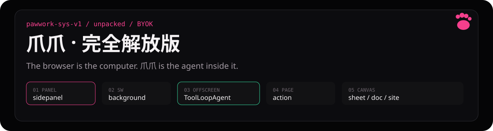
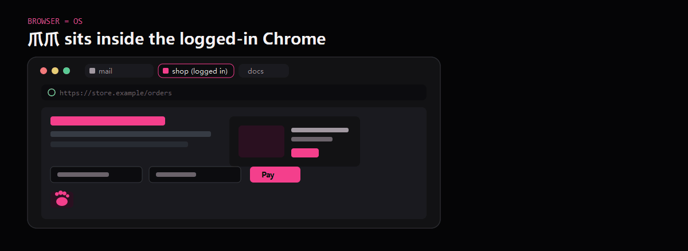
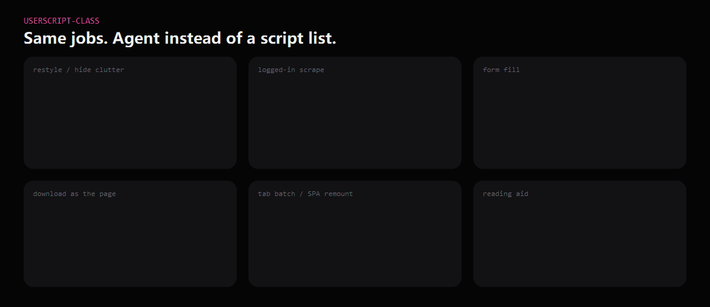
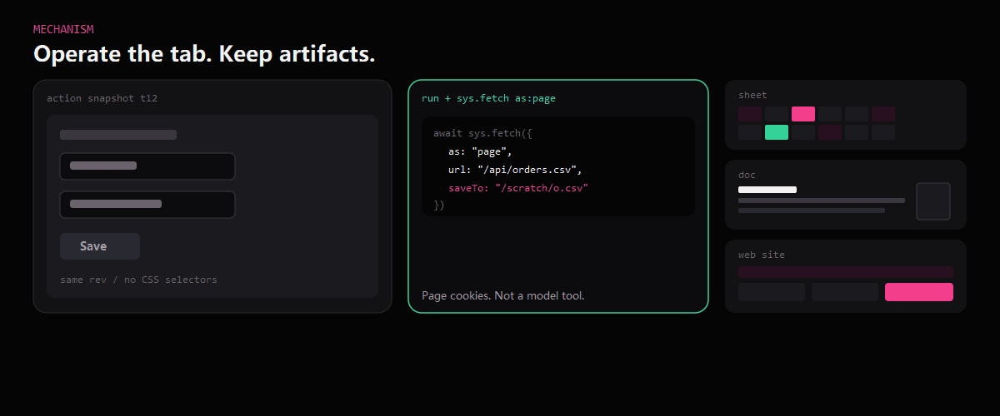

<div align="center">

# 爪爪 · 完全解放版

中文 · [English](README.md)

[](LICENSE)
[](https://github.com/Player-YN/PawWork_ZhuaZhua/commits/main)
[](https://github.com/Player-YN/PawWork_ZhuaZhua)
[](manifest.json)
[](README.zh-CN.md#运行)

把已经登录的 **[Chrome 当成一台可编程计算机](README.zh-CN.md#你得到什么)**。爪爪是这台机器上的 **agent**。

*侧栏 → Service Worker → offscreen agent · 工具：`action` · `run`+`sys` · `sheet` / `doc` / `web`*

[你得到什么](#你得到什么) · [运行](#运行) · [边界](#边界) · [用例](#用例) · [机制](#机制) · [下一步](#下一步)

</div>

<p align="center">
  
</p>

**爪爪 · 完全解放版**（仓库名 `PawWork_ZhuaZhua`）是 Chrome MV3 **未打包**扩展。不是选区小工具，也不上架 Chrome 网上应用店。

## 你得到什么

侧栏里的通用 agent：能操作当前标签，用访客机 JS 驱动浏览器（`sys` 在 `run` 里，不是单独工具），并在会话里留下 **表格 / Univer 文档 / 站点 HTML**。

<p align="center">
  
</p>

油猴类 userscript 能干的事都在范围内。没有脚本商店。打包 playbook 目前只有 `page-restyle`。

## 运行

加载后侧栏标题应是 **爪爪 · 完全解放版**。没有 Chrome 网上应用店安装包。

1. 下载 [Release zip](https://github.com/Player-YN/PawWork_ZhuaZhua/releases)，**或** clone 本仓库后用 `extension/` 文件夹
2. Chrome → `chrome://extensions` → 开发者模式 → **加载已解压的扩展程序** → 选那个文件夹（根上就是 `manifest.json`）
3. 打开侧栏 → 填 BYOK Key（`pagewand_providers`）→ 在普通 `http(s)` 页面发一条任务

改完加载文件夹里的文件后，到扩展卡片点 **重新加载**。日常不跑 `npm`。

## 边界

这些会改变你要不要加载，以及第一条任务能碰什么。

需要 Chrome 135+。Chrome 138+ 若要用 `sys.eval` / 页面身份 fetch：扩展详情打开 **允许运行用户脚本**。用 CDP 前关掉目标标签的 F12（否则 `CDP_BUSY`）。限制页（`chrome://`、网上应用店）会 `NEED_PAGE`。

| 如果你想要 | 实际有的 |
|---|---|
| CWS 安装 | 没有。只能未打包加载。 |
| 托管模型 | 没有。自己带 Key。 |
| Design / Slides | 没了。 |
| 油猴脚本目录 | 没有。打包 skill 只有 `page-restyle`。 |
| `chrome://` / 网上应用店页 | `NEED_PAGE`。 |

## 用例

试过的和说得通的都算 —— 不是跑分榜，也不是脚本市场。

<p align="center">
  
</p>

- 改页面样式 / 藏掉干扰（`page-restyle`，或 `run` + `sys.eval`）
- 抓已登录页面（`sys.fetch` as page → sheet）
- 自动填表（`action` 的 `snapshot` / `fill_form`）
- 用页面身份下载（`sys.download` 或页面 fetch）
- 批量标签 / `navigate` 之后停在 SPA 上
- 在同一标签注入阅读辅助

Design / Slides / tldraw **已删除**。不要找演示文稿画布。

## 机制

<p align="center">
  
</p>

侧栏 → Service Worker → offscreen `SessionWorkspaceService` → AI SDK `ToolLoopAgent`。

| 你调用 | 它做什么 |
|---|---|
| `action` | 当前活页。先 `snapshot`，再用同一代 `ref` + `rev` 点/填 |
| `run` | 沙箱 JS。访客 `sys`：标签、eval、fetch、cdp、下载、截图 |
| `sheet` / `doc` / `web` | Univer 表、Univer 文档、`data-paw-kind=site` |
| `inspect` / `acquire` / `clarify` | 读会话、把公开网带进来、暂停提问或出计划卡 |

`sys` **不是**模型工具。要登录态 / cookie / 验证码：在 `run` 里写 `sys.fetch({ as: "page" })`。

## 下一步

分层与工具契约见 [AGENTS.md](AGENTS.md)。English homepage: [README.md](README.md).

```text
node --test tests/runtime-regression.test.mjs
```

## 许可

[MIT](LICENSE)。
